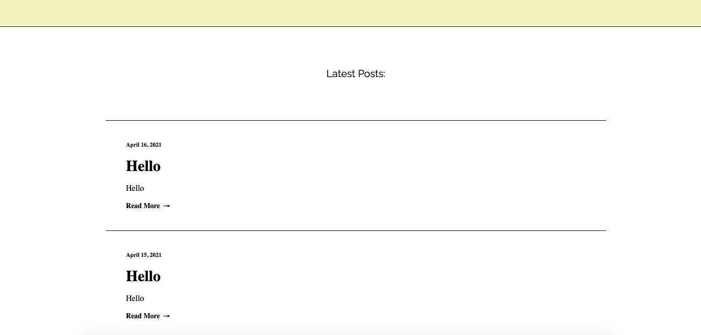

# portfolio-site# Portfolio-website
# Portfolio-website

# URLs
URL: https://anthony-lu.netlify.app/index.html
GitHub Repo: https://github.com/AnthonyALu/Portfolio-website

# Description

# Purpose

The purpose of this website is to show future employers or collaborators a portfolio of my work and who I am. It will be used to showcase my previous work as well as what I am capable of as demonstrated by the features of the website. The website will also provide contact details so that potential partners can reach me on socials or by email.

# Functionality / Features

Logo - Animated logo that links to the home screen.
Navigation Bar - Easy navigation on all pages
Call to action buttons - Animated read more/overlay buttons to engage audience and convince them to see more of my work/blogs
Animated visuals - Animations to help retain attention
Footer - Contains contact details
Social media icon buttons - Helps potential partners find me on socials
About me page - Contains information about me and what skills I have
Projects page - Showcase of previous projects
Blog page - Blog for people to read what I have been up to
Clean website - Not too many animations or hover effects so that it is easy to read and straight to the point
Styling visuals - Helps retain attention
Easy navigation - Navigation bar on all pages and navigation buttons to see previous/next project/blogs
Responsive design - Website still works on mobile

# Sitemap

# Screenshots

Home Page:

Work Page:

Projects Page:

Blog Page:

Blog Post Page:

# Target Audience

The target audience for my website will be future employers and potential collaborators. 

# Tech Stack

- Hypertext Markup Language (HTML)
- Cascading Style Sheets (CSS)